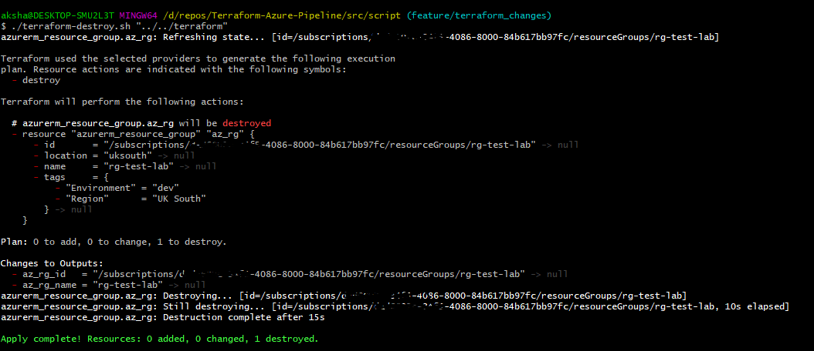

#  Project for Azure Pipelines

This project for Azure Pipelines deploying resources on Terraform.

## Contents

| File/folder             | Description                                         |
|-------------------------|-----------------------------------------------------|
| `azure`                 | YAML pipeline templates for terraform code.         |
| `src/script`            | Bash code for running terraform init,plan and apply |
| `src/script/additional` | Prerequisite for running terraform pipeline.        |
| `terraform`             | Terraform code for generating resources.            |
| `README.md`             | This README file.                                   |
| `images`                | All the snapshots in readme.                        |

## Prerequisite

1. Run the [bash script](https://github.com/akshaykalra92/TerraformAzurePipeline/blob/main/src/script/additional_script/azure-create-service-principal.sh) script to generate the service principal, key vault and store the client secret in key vault.

For more information refer: [Doc](https://github.com/akshaykalra92/TerraformAzurePipeline/blob/main/src/script/additional_script/service-principal.md)

2. Run the [bash script](https://raw.githubusercontent.com/akshaykalra92/TerraformAzurePipeline/main/src/script/additional_script/azure-create-storage-account.sh) script to create the storage accoutn for storing the backend config for terraform.
   
For more information refer: [Doc](https://github.com/akshaykalra92/TerraformAzurePipeline/blob/main/src/script/additional_script/storage-account.md)

## Templates

### 101 Basic Terraform job pipeline

We have two pipelines one for apply pipeline for terraform Env setup, Init, Plan & Apply and another pipeline for terraform destroy.

### 201 Separate stages

The next template shows how to build a multi-stage pipeline. we have 3 stages: Init/Plan, Apply and Destroy.

## Azure DevOps pipeline

Before running the pipeline create the manual Service Connection of type Azure Resource Manager at subscription scope. Name the Service Connection `Terraform-lab`. Allow all pipelines to use the connection.

## APPLY PIPELINE

Create the apply pipeline and run it.

Add approval & check manually on the azure devops environment, so that we can review the plan and provide approval before doing terraform apply.

## Destroy PIPELINE
Create the destroy pipeline and run it.

## Manual Terraform Script

I have also manually tested each terraform bash script.

Create tf.auto.tfvars to run the terraform cli.

AZURE_CLIENT_ID = "XXXXXXXXXXX-8dc68ebe4dc4"

AZURE_CLIENT_SECRET = "XXXXXXXXXXXXX.a74"

AZURE_SUBSCRIPTION_ID = "XXXXXXXXXXXXd97fc"

AZURE_TENANT_ID = "cXXXXXXXXXXXXXXXXXXX1030d8"

### Terraform Init, Plan and Apply

###### Terraform init stage also has validation stage for sanity check.

### Terraform Destroy

